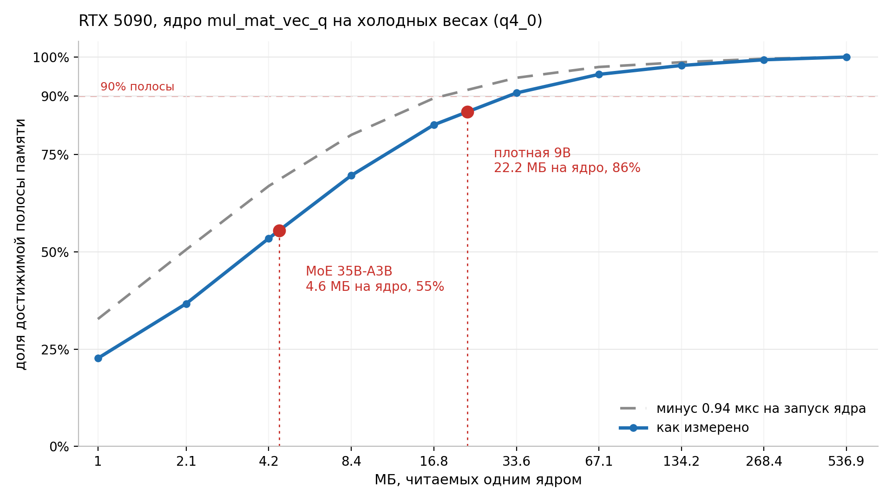

# Same GPU, same build: dense model gets 72% of memory bandwidth, MoE gets 41%

RTX 5090, one llama.cpp build (b10326, commit `3653e6d6d`), one driver, Q4_0, batch 1. Dense Qwen3.5-9B pulls 72% of the card's memory bandwidth. MoE Qwen3.5-35B-A3B on the same card pulls 41%.

The MoE is still faster in absolute terms, 317 tokens per second against 240. It just leaves about 1.4x of its own ceiling unused, for a reason that turns out to be measurable.

Expert routing is not the reason. I measured that separately.

> What is measured: card bandwidth, a bandwidth-versus-read-size curve taken with the real ggml kernel, a per launch breakdown of every matvec from an nsys trace, server overhead. What is predicted and then checked: a different model's speed (3.7% error) and speed at four context depths (within 2.4%). What is predicted and not checked: the payoff from fusing kernels, somewhere between 1.38x and 1.54x.

## Setup

| | |
|---|---|
| GPU | RTX 5090, 32 GB GDDR7, sm_120, 170 SMs |
| driver | 580.159.03 |
| llama.cpp | b10326, commit `3653e6d6d`, CUDA 12.8 |
| quant | Q4_0 in llama.cpp terms, actually a mix: q6_K head, some q8_0 and q5_0 tensors, a third of matvecs in f32 |
| spec bandwidth | 1792 GB/s |
| measured bandwidth | **1671.0 GB/s** (93% of spec) |
| ggml kernel curve peak | 1683 GB/s |
| torch reduction curve peak | 1638 GB/s |

I measured bandwidth instead of taking it from the spec sheet. The spec number is not reachable, and every downstream conclusion shifts if you divide by it. A sequential read of a 1.5 GiB buffer gave 1671.0 GB/s with 0.18% spread over sixty samples. Three different reduction kernels (`sum` on f32, `max` on f32, `sum` on f16) agreed within 0.34%, so what I measured is memory rather than one particular kernel.

Speed, five repeats per point:

```
llama-bench -m <model>.gguf -p 0 -n 512 -d 0 -r 5 \
            -ngl 99 -sm none -fa 1 -ctk f16 -ctv f16 -t 16
```

Headline numbers are at **empty context** (`-d 0`). Bytes per token depend on depth, so the table below holds only there. I also ran 4096, 16384 and 32768: with `fa=1` and f16 KV the drop at 32K is 14.5%, from 317.45 to 271.53 t/s.

Bytes per token come from GGUF metadata, using the actual tensor types rather than the nominal bits per weight of the quant name:

| | MoE 35B-A3B | dense 9B |
|---|---|---|
| layers | 41 (11 attention, 30 GDN) | 33 (9 attention, 24 GDN) |
| experts | 256 total, 8 routed plus 1 shared per token | none |
| weights per token | 2.007 GB | 4.900 GB |
| GDN state (read and write) | 0.126 GB | 0.101 GB |
| total per token | **2.133 GB** | **5.000 GB** |
| measured | **317.45 t/s** (0.74% spread) | **239.62 ± 0.86 t/s** |

The embedding is excluded: `token_embd.weight` is 286 MB, but a single token reads one row of 1.1 KiB from it. The `output.weight` head is the opposite case, read in full every token, so it counts. Counting the embedding whole would overstate weights by 14%, which is larger than several of the effects measured later in this post.

That gives utilization. MoE: 2.133 GB in 3.150 ms is 677 GB/s, or 41% of 1671. Dense: 5.000 GB in 4.173 ms is 1198 GB/s, or 72%.

## Three suspects that did not hold up

Before looking for a new explanation I worked through the obvious ones.

The first suspect was CUDA graph capture. MoE tensor shapes can change between tokens as routing changes, which could break capture. The nsys trace shows 127 graph launches for 128 decoded tokens, and llama.cpp reports no disable reason. Graphs are captured, on the MoE and on the dense model.

The second suspect was routing itself. The `topk_moe` kernels plus row gathering take 7.0% of kernel time, while matvecs take 51%. Routing is not free, but it does not explain a gap this size.

The third was idle gaps between launches. `nvidia-smi dmon` on a clean run without a profiler shows 97% SM busy. The card is working nearly all the time. It is just doing the work slower than memory would allow.

That last point is the one that matters. If the GPU is busy 97% of the time while bandwidth utilization sits at 41%, the kernels are running but reading memory inefficiently.

## A kernel has to read enough bytes

The hypothesis is simple: while a kernel reads only a little, it never gets enough requests in flight to saturate the memory controller.

Testing that requires the real kernel and cold data. I wrote a small ggml program that allocates N distinct matrices totalling 4 GiB and calls the same `mul_mat_vec_q` the model uses. The working set is forty times the 96 MiB L2, so by the time the program comes back to a matrix it has been evicted. That matches decode, where each weight is read once per token and never reused.



| MB per kernel | 1.0 | 2.1 | 4.2 | 8.4 | 16.8 | 33.6 | 67 | 134 | 537 |
|---|---|---|---|---|---|---|---|---|---|
| GB/s | 381 | 617 | 899 | 1171 | 1390 | 1528 | 1608 | 1646 | 1683 |
| % of peak | 23% | 37% | 53% | 70% | 83% | 91% | 96% | 98% | 100% |

The curve peaks at 1683 GB/s against the 1671 GB/s measured independently by a plain bandwidth test, a 0.7% difference. The three bandwidth numbers in the setup table differ by which kernel produced them, which is itself a reminder that "card bandwidth" is incomplete without naming the kernel.

### How much of this is just launch cost

Fair objection: maybe this curve measures kernel launch overhead rather than a bandwidth ramp. At 1 MB a kernel lives 2.75 µs, and the cost of a CUDA graph node, measured separately, is 0.94 µs. That is a third of the point.

Subtracting that constant from every measurement:

| MB per kernel | 1.0 | 4.2 | 16.8 | 33.6 | 134 | 537 |
|---|---|---|---|---|---|---|
| as measured | 23% | 53% | 83% | 91% | 98% | 100% |
| minus launch | 33% | 67% | 89% | 95% | 99% | 100% |

The curve does not flatten. Even at zero launch cost a 4.2 MB read gets two thirds of bandwidth. The size at which 90% is reached moves from roughly 34 MB to roughly 18 MB. So launch accounts for about a third of the shortfall at small sizes and the remaining two thirds is ramp.

The rest of this post uses the curve as measured, because a real engine pays launch cost too. The mechanism is genuinely two things, though, and collapsing it to launch overhead alone would be wrong.

## Where both models sit on that curve

Matvec counts come from the same nsys trace:

| | matvecs per token | bytes per matvec | share of bandwidth |
|---|---|---|---|
| MoE 35B-A3B | 437.8 | **4.6 MB** | 55% |
| dense 9B | 220.4 | **22.2 MB** | 86% |

That is the whole gap. The average hides the interesting part, so here is every one of those 437.8 matvecs broken out by launch grid, straight from the trace:

| weight type | grid.x | launches per token | per layer | median µs | share of time |
|---|---|---|---|---|---|
| q4_0 | 512 | 76.2 | 1.86 | 9.22 | 24.0% |
| q4_0 | 8192 | 36.6 | 0.89 | 9.54 | 14.8% |
| q6_K | 248320 | **1.0** | head | 256.35 | 11.2% |
| q4_0 | 2048 | 26.4 | 0.64 | 5.02 | 8.0% |
| q8_0 | 512 | 60.9 | 1.49 | 2.72 | 7.7% |
| f32 | 256 | 40.6 | 0.99 | 4.38 | 7.7% |
| q4_0 | 4096 | 30.5 | 0.74 | 5.15 | 6.7% |
| f32 | 32 | 60.9 | 1.49 | 1.98 | 5.0% |
| q5_0 | 512 | 40.6 | 0.99 | 2.50 | 4.6% |
| q8_0 | 2048 | 14.2 | 0.35 | 7.42 | 4.5% |
| f32 | 1 | 40.6 | 0.99 | 1.44 | 2.6% |
| q6_K | 8192 | 4.1 | 0.10 | 11.87 | 2.1% |
| q4_1 | 512 | 5.1 | 0.12 | 5.09 | 1.1% |
| **total** | | **437.8** | | | **100%** |

Share of time comes from summing actual durations, not from median times count, so multiplying the columns will not reproduce it.

Two things in there surprised me.

Experts are processed **in a batch, not one at a time**. All q4_0 variants together come to 4.1 launches per layer, not the 24 you would get from looping over eight experts with three projections each. The `mul_mat_vec_q` signature carries an index array pointer, so this is the indirection path. The problem is not one kernel per expert. The problem is that eight experts out of 256 is a small number of bytes even when they are gathered into a single launch, and the kernel still lands below the threshold.

The head runs as **one** launch per token and reads 417 MB. It achieves 1601 GB/s, or 96% of bandwidth. The other 436.8 launches read 3.64 MB on average and achieve 767 GB/s, or 46%. The curve predicts 841 GB/s (50%) at 3.64 MB, and the trace number sits lower because it carries profiler inflation. So the real kernels, including the routed ones with indirection, land on the synthetic curve within a few percent, and a single model contains both a kernel at full bandwidth and hundreds at half.

An objection suggests itself here: the routed kernels launch 512 blocks onto 170 SMs, so maybe the card is simply underfilled and that is the whole story. The row length sweep answers it. At K = 1024, 4096 and 16384 the block count changes by 16x while the bytes read stay at 4.2 MB, and bandwidth holds within 4%, giving 869, 845 and 836 GB/s. Block occupancy varied by a factor of sixteen and moved nothing.

The dense model reads its matrices whole, lands above the threshold, and takes the bandwidth.

## Predicting a different model

Everything above came from the MoE. To tell a rule from a fit, I took the curve measured on the MoE and used it to predict dense Qwen3.5-9B, a different architecture with 33 layers instead of 41 and no experts at all.

Prediction made before the measurement:

```
matvecs per token             220.4  (from the profile)
bytes per matvec              22.2 MB
bandwidth from the curve      1445 GB/s (86% of peak)
matvec time                   3.390 ms
638 other kernels at 0.88 µs  0.561 ms
GDN state                     0.072 ms
total                         4.023 ms, or 248.6 t/s
```

Measured: 4.173 ms, or 239.62 ± 0.86 t/s. Error 3.7%, with the prediction on the optimistic side. The residual most likely sits in the small kernel estimate, which was fitted on the MoE while the dense model has a different kernel mix.

### A second check, on a different axis

Model architecture is one axis. Context depth is a second one, and it costs nothing extra to test. Matvec count does not change with depth, only KV traffic does, and KV bytes come from metadata (22528 bytes per context token across eleven attention layers). So the model has to predict the whole depth curve without any new measurement:

| depth | KV per token | predicted | measured | error |
|---|---|---|---|---|
| 0 | 5.8 MB | 317.1 | 317.45 | −0.1% |
| 4096 | 98.0 MB | 311.6 | 309.88 | +0.6% |
| 16384 | 374.9 MB | 296.3 | 289.52 | +2.4% |
| 32768 | 744.0 MB | 278.1 | 271.53 | +2.4% |

Absolute speed lands within 2.4% across the range. The drop itself comes out at 12.3% against a measured 14.5%, so the model underestimates the cost of depth by about a fifth of the effect and misses something in the KV path. This is still the stronger of the two checks, because the first one used a different model from the same family while this one uses a different physical quantity.

## The threshold seems to scale with card width

This section is weaker than the rest, and I want to say why before showing the table.

I have no ggml build of the benchmark on the laptop RTX 4060, so I could not compare cards using the real kernel. Both columns below come from a simpler synthetic kernel (a torch reduction over the same cold slices). They are comparable to each other but not to the absolute numbers above:

| | RTX 4060 | RTX 5090 | ratio |
|---|---|---|---|
| SMs | 24 | 170 | 7.1x |
| measured bandwidth | 249 GB/s | 1638 GB/s | 6.6x |
| 80% threshold | 8.4 MB | 67.1 MB | 8.0x |
| 90% threshold | 16.8 MB | 134.2 MB | 8.0x |

Two reasons to treat this as preliminary. The sweep doubles at every step, so the threshold is only known to within a factor of two, which is not enough to tell scaling by SM count (7.1x) from scaling by bandwidth (6.6x). And the threshold value itself depends on the kernel: the torch reduction puts the 90% point at 134 MB on the 5090 while the real ggml matvec puts it at 34 MB, four times lower. The threshold is a property of the card and kernel together, not of the memory subsystem alone.

What survives is the direction. The wider the card, the larger kernels have to be, and code tuned on a 4060 will be fine grained on a 5090. The coefficient needs a proper fine grained sweep on both cards with one kernel.

## Four ways to measure this wrong

I fell into each of these in order.

### L2 eats a naive size sweep

The obvious approach is to sweep reads from 64 KB to 64 MB and find the plateau. L2 is 96 MiB on the 5090 and 32 MiB on the 4060, so the whole range fits in cache and the plateau appears within the first few kilobytes. At 64 MiB I got 4285 GB/s against a physical 1683. The fix is to rotate: every launch reads its own slice of a large pool, and by the time the pool wraps around the data has been evicted.

### `test-backend-ops` measures cache

llama.cpp ships a tool that runs real ggml kernels on given shapes, which sounds ideal. For `q4_0` at m=4096, k=14336, n=1 it reported 9.04 µs per call. The matrix is 33 MB, so that works out to 3654 GB/s, more than twice physical. In `perf` mode the tool duplicates one graph node as many times as needed, the matrix settles into L2, and every later read comes from there. Any benchmark that reuses a tensor measures cache, while decode reads each weight once per token.

### Python instead of CUDA

To get the cost of a kernel launch I first timed it through torch: fire N trivial kernels into a stream and divide. That gave 9 to 18 µs per launch, almost independent of N. The number was garbage. After the CPU released the queue, the GPU took another 0.02 µs to finish, meaning the card idled the whole time and I had measured Python dispatch. One torch call from Python costs single digit to double digit microseconds, an order of magnitude more than a kernel launch. Only the captured CUDA graph measurement is valid, because `replay()` has no Python in the loop. That gave 0.94 µs per node.

### The profiler lies unevenly

`nsys profile --cuda-graph-trace=node` is needed to see kernels inside a graph by name. Without it the whole graph collapses into one row and the question "how many kernels per token" has no answer. But that tracing adds time, and it adds it disproportionately. Summing all kernel durations gave 4.558 ms per token against a clean 3.150 ms. Kernels run sequentially in one stream, so the sum cannot exceed token latency, which means some durations are inflated. Matvecs living around 5 µs are inflated by roughly 1.1x, while kernels near a microsecond are inflated by about 2x. Time shares from such a trace are usable, absolute values are not. On the 4060 the same tracing gave 22.271 ms per token against 22.297 ms clean, essentially no distortion, because kernels there are thirty times longer and a constant per kernel addition disappears against them.

## What actually reaches the user

This is the most practical part, and it has nothing to do with the GPU.

`llama-bench` measures the engine. People run `llama-server`, which adds sampling, detokenization, slot handling and HTTP on top. Same box, same model, 512 tokens, three repeats per configuration:

| | ms per token | running total |
|---|---|---|
| engine, `llama-bench` | 3.150 | 3.150 |
| server loop with greedy sampling | +0.279 | 3.429 |
| real sampler (top_k 40, top_p 0.9, min_p, repeat_penalty) | **+0.723** | 4.152 |
| HTTP and prefill per request | +0.291 | 4.443 |

The user sees 225 t/s where the benchmark shows 317, a 29% drop.

The expensive part is the sampler at 0.723 ms per token, close to a quarter of the entire engine time. That is CPU work over a quarter million token vocabulary and has nothing to do with the GPU. Streaming, against my expectation, costs nothing: 225.8 t/s without it and 225.1 with it.

While I was there I also checked the driver. Going from 570.195.03 to 580.159.03 gives 8.0% on decode as the median over twelve matched points, and 5.8% on prefill. Perplexity is identical to four decimals (5.7732 ± 0.0434 on both drivers) and kernels per token are the same. The mechanism shows up in the curve: at 1 MB per kernel the new driver gives 8.6%, at 33.6 MB it gives 2.0%, at 537 MB it gives 0.3%. It made launches cheaper without touching execution. The cost of graphs says the same thing: with `GGML_CUDA_DISABLE_GRAPHS=1` the old driver loses 26.8% and the new one loses 14.0%.

## What follows from this

Everything below is a projection rather than a measurement. I have written no fused kernels, and I have not surveyed what already exists in ik_llama.cpp or mainline.

If you keep K matvecs instead of the current 438, each reads 2.007 GB / K and the curve gives the bandwidth. One detail changes the answer by a factor of two. The `quantize_q8_1` kernel runs exactly once per quantized matvec: 438 matvecs minus 142 f32 ones gives 296 quantizations, which is the measured count. Eight experts on a layer read the same activation vector, so fusing them leaves one quantization instead of eight. Projections in different layers read different activations, so there it does not shrink.

Hence two bounds:

| matvecs per token | per layer | MB per kernel | % of bandwidth | t/s, quantization shrinks | t/s, quantization stays |
|---|---|---|---|---|---|
| 438 | 10.7 | 4.6 | 55% | 317 | 317 |
| 219 | 5.3 | 9.2 | 71% | 392 (1.24x) | 373 (1.18x) |
| 109 | 2.7 | 18.3 | 84% | 447 (1.41x) | 411 (1.30x) |
| 41 | 1.0 | 49.0 | 93% | 489 (1.54x) | 438 (1.38x) |

The bandwidth column comes straight from the measured curve. The speed in the last two columns rests on extrapolation: besides matvecs there are 1142 other kernels per token costing about 1.0 ms, and I price them at 0.88 µs each by dividing the leftover time by their count. That estimate is fitted at a single point. It agrees with the independently measured graph node cost of 0.94 µs, but it has never been tested at small N.

The unpleasant part follows from the table. Fusing matvecs alone tops out between 1.4x and 1.5x even at one matvec per layer, because those 1142 small kernels still cost a millisecond. Going further means cutting them too.

And one more thing I did not expect. The 1.29 ms of server overhead per token does not go away when kernels get fused. So 1.54x on the engine reaches the user as 1.33x, and a perfect engine sitting on the memory roof would give 1.73x. The sampler costs 0.72 ms and comes off on the CPU with no CUDA at all. In magnitude that is comparable to everything fusion can win, and in effort it is nowhere close. I would start there.

## Caveats

Average size instead of a per kernel sum. I take bytes, divide by matvec count and read one bandwidth off the curve, when summing per kernel would be more honest: the curve is concave and the size distribution is bimodal. I split it into two groups and recomputed through the curve: a 417 MB head plus 436.8 launches of 3.64 MB gives 2.139 ms against 2.150 ms from the average, a 0.5% difference. The bias exists and points the expected way, but it settles nothing on this data. Do not confuse those with the trace numbers above (1601 and 767 GB/s), which carry profiler inflation and therefore sit below the curve.

A third of the matvecs are priced off the wrong curve. Of 437.8 matvecs, 142.2 run in f32 while the curve was taken on q4_0. For f16 the gap reaches 21% at 4.2 MB, so that part of the estimate is biased. It goes into the "55% of bandwidth" figure uncorrected.

Achieved bandwidth is not from a counter. It comes from dividing bytes by time rather than from `dram__throughput` in Nsight Compute. ncu would not run on the rented pod: the container has no `CAP_SYS_ADMIN` and the counters are closed even to root, which cannot be changed from inside.

The MoE path was not tested on its own. The synthetic benchmark runs a plain matvec over distinct matrices, while routing in llama.cpp goes through the indirection variant. The access pattern may differ and I did not measure it.

Q4_0 only. I did take curves for q8_0, q6_K and f16. They are nearly indistinguishable from each other, while f16 is 21% faster than q4_0 at 4.2 MB with the gap closing entirely by 537 MB, which says dequantization is a fixed per kernel addition rather than a bandwidth loss. K quants, which is what most people actually run, were not tested at all.

Batch 1 only. The brief was single stream, so batches of 2, 4 and 8 were never measured. That is probably the cheapest decisive test left: larger batches mean more work per expert, and utilization should climb the same curve.

No other engines. vLLM, SGLang and TensorRT-LLM were not run on this box. The claim that 1.4x is sitting on the table is checkable with someone else's runtime, and without that it remains a statement about llama.cpp rather than about the hardware.

Two models, both from one family (Qwen3.5 9B and 35B-A3B). Two cards, RTX 5090 and a laptop RTX 4060.

Cloud, not a lab. Every 5090 number came from rented cards. Three pods with three different CPUs gave consistent results, which helps, but a rented pod is not a controlled bench.

The curve is taken by a ggml program of about a hundred lines. It builds against any llama.cpp checkout, and you can reproduce it on your own card in an evening.
