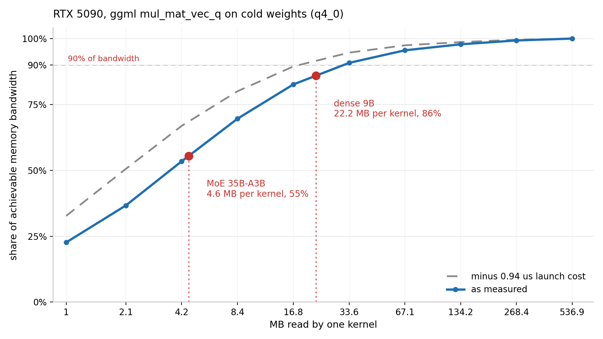

# Why is Qwen3.5-35B-A3B slow on an RTX 5090?

Short answer: it is not slow. It runs at 317 t/s while a dense 9B on the same card runs at 240. But it only pulls **41% of the card's memory bandwidth** where the dense model pulls **72%**, and the whole difference comes down to how many bytes one kernel reads per launch.

Expert routing is not the cause. CUDA graphs are captured. The GPU is 97% busy. All three were measured and ruled out.



## The result in one table

| | matvecs per token | bytes per matvec | share of bandwidth | t/s |
|---|---|---|---|---|
| MoE 35B-A3B | 437.8 | 4.6 MB | 55% | 317.45 |
| dense 9B | 220.4 | 22.2 MB | 86% | 239.62 |

A kernel does not reach full bandwidth until it reads enough. On an RTX 5090 a 1 MB read gets 23% of achievable bandwidth, 4.2 MB gets 53%, and 33.6 MB gets 91%. MoE splits weights across 256 experts and activates 8 per token, so even gathered into one launch that is only a few megabytes per kernel.

## Write-ups

- [POST-en.md](POST-en.md), full write-up in English
- [POST-ru.md](POST-ru.md), same in Russian
- [HARNESS-en.md](HARNESS-en.md), how the harness itself works
- [HARNESS-ru.md](HARNESS-ru.md), the same, in Russian

## What is in here

```
measure/
  bench_matvec_cold.cpp   the bandwidth curve: real ggml kernel, N distinct
                          matrices, 4 GiB working set so data is always cold
  kernel_cost.py          graph node cost, read size sweep, ceiling estimate
  bandwidth.py            achievable memory bandwidth, with cross checks
  bench.py                llama-bench matrix with cooldown, shuffling, anchor
  profile.sh              nsys capture (needs --cuda-graph-trace=node)
  perplexity.sh           quality gate, per KV cache type
  server_overhead.sh      llama-server against llama-bench
analyze/
  bytes_per_token.py      bytes read per token from GGUF metadata
  decompose.py            measured time against the memory roofline
  attribute.py            kernels per token, graph capture, top kernels
  report.py               assembles report.md
common/                   host config and environment capture
config/                   one file per machine, the only thing that differs
run_all.sh                stages 0 and 2 through 8 in one command
data/                     raw measurements behind every number in the posts
```

## Reproducing the curve

The interesting part is about a hundred lines of ggml. It builds against any llama.cpp checkout and runs in a few minutes:

```bash
git clone --depth 1 --branch b10326 https://github.com/ggml-org/llama.cpp
cmake -S llama.cpp -B llama.cpp/build -DGGML_CUDA=ON \
      -DCMAKE_CUDA_ARCHITECTURES=120 -DCMAKE_BUILD_TYPE=Release
cmake --build llama.cpp/build -j

g++ -O2 -o bench_matvec_cold measure/bench_matvec_cold.cpp \
    -I llama.cpp/ggml/include -L llama.cpp/build/bin \
    -lggml -lggml-base -lggml-cuda -Wl,-rpath,llama.cpp/build/bin

./bench_matvec_cold q4_0 4096 4.0     # type, row length, working set in GiB
```

Two things that will give you a wrong answer if you skip them: the working set has to exceed L2 by a wide margin (96 MiB on a 5090, 32 MiB on a 4060), and every launch has to touch a different matrix. Reusing one tensor measures cache. `test-backend-ops perf` reuses one tensor and reports 3654 GB/s on a card whose memory does 1683.

## Full pipeline

```bash
./run_all.sh --model <model>.gguf --data wiki.test.raw
```

Runs environment capture, bandwidth, the llama-bench matrix (optionally duplicated with `GGML_CUDA_DISABLE_GRAPHS=1`), bytes per token, the roofline decomposition, nsys profiling with attribution, perplexity for both KV types, and a report. Machines differ only by `config/<host>.json`; the host is picked automatically from the GPU name.

## Measured on

RTX 5090 (sm_120, 170 SMs) with drivers 570.195.03 and 580.159.03, and a laptop RTX 4060 (sm_89, 24 SMs). llama.cpp b10326, commit `3653e6d6d`, CUDA 12.8. Models: Qwen3.5-35B-A3B Q4_0 and Qwen3.5-9B Q4_0.

Every number in the posts traces to a file under `data/`.

## Known gaps

Batch is 1 throughout, by design. K quants were not tested. Achieved bandwidth is bytes divided by time rather than a `dram__throughput` counter, because the rented container had no `CAP_SYS_ADMIN` and Nsight Compute could not read counters. No comparison against vLLM, SGLang or TensorRT-LLM. The fusion projection at the end of the posts is a projection: no fused kernel was written.

MIT.
